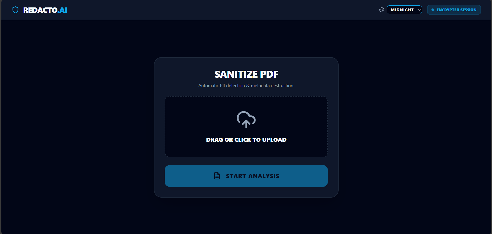
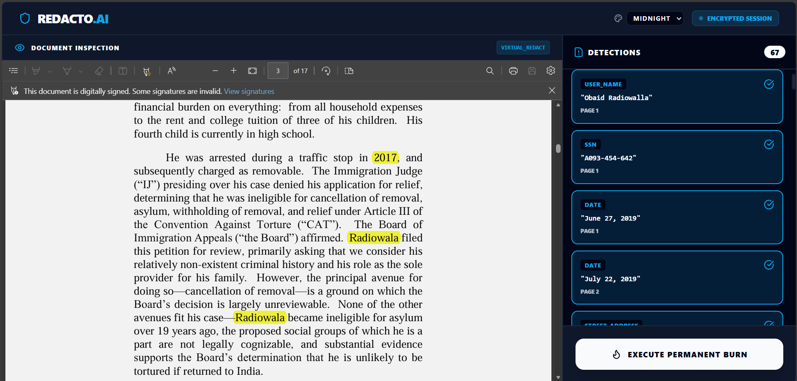

# 🛡️ Redacto: Automated Legal Document Redaction System

**Redacto** is an intelligent, dual-model AI system designed to automatically detect and redact sensitive Personally Identifiable Information (PII) from unstructured legal documents and scanned PDFs. It prioritizes a high recall rate and strict privacy compliance while preserving the contextual integrity of the document.





---

## 🏗️ System Architecture

Redacto uses a decoupled architecture. The frontend is a modern React/Vite Single Page Application (SPA), while the backend is a Python-based FastAPI microservice that handles heavy GPU inference.


### The AI Pipeline

| Step | Component | Model / Library | Role |
|------|-----------|-----------------|------|
| 1 | **Context Extraction** | IBM `docling` | Understands document structure (headers, tables, paragraphs) |
| 2 | **The Finder** | `nvidia/gliner-pii` (GLiNER) | Aggressively identifies potential PII with high sensitivity |
| 3 | **The Judge** | `facebook/bart-large-mnli` (BART Zero-Shot) | Evaluates ambiguous entities — private individual vs. public official |
| 4 | **The Renderer** | `PyMuPDF` | Permanently burns black boxes over sensitive data, rendering it unrecoverable |

---

## 📂 Project Structure

This project uses a decoupled architecture for independent cloud deployments (Vercel + Hugging Face), with source code split across two repositories:

| Layer | Stack | Repository |
|-------|-------|------------|
| **Frontend** | React + Vite + Tailwind CSS | [ahmedfarazsyk/redacto_ui](https://github.com/ahmedfarazsyk/redacto_ui) |
| **Backend** | FastAPI + PyTorch + Transformers | [ahmedfarazsyk/redacto-api](https://huggingface.co/spaces/ahmedfarazsyk/redacto-api) |

---

## 💻 Frontend Setup (React / Vite)

The frontend is deployed on Vercel but can be run locally.

### 1. Clone the Repository

```bash
git clone https://github.com/ahmedfarazsyk/redacto_ui.git
cd redacto_ui
```

### 2. Install Dependencies

Ensure [Node.js](https://nodejs.org/) is installed, then run:

```bash
npm install
```

### 3. Configure Environment Variables

Create a `.env` file in the root of the `redacto_ui` directory:

```env
# .env
VITE_API_URL=http://localhost:8000
```

> **Note:** For production, set this to your Hugging Face Space URL via the Vercel dashboard.

### 4. Run the Development Server

```bash
npm run dev
```

The application will be live at **http://localhost:5173**.

---

## ⚙️ Backend Setup (FastAPI / Hugging Face)

The backend relies on heavy machine learning models. This project uses [`uv`](https://github.com/astral-sh/uv) — an extremely fast Python package manager written in Rust — to handle dependencies.

### 1. Clone from Hugging Face Spaces

```bash
git clone https://huggingface.co/spaces/ahmedfarazsyk/redacto-api
cd redacto-api
```

### 2. Install `uv`

| Platform | Command |
|----------|---------|
| macOS / Linux | `curl -LsSf https://astral.sh/uv/install.sh \| sh` |
| Windows | `powershell -ExecutionPolicy ByPass -c "irm https://astral.sh/uv/install.ps1 \| iex"` |

### 3. Install Dependencies

```bash
# Install all dependencies listed in pyproject.toml.
uv sync
```

### 4. Run the API Server

```bash
uvicorn app:app --host 0.0.0.0 --port 8000 --reload
```

The API will be live at **http://localhost:8000**.  
Interactive API documentation is available at **http://localhost:8000/docs**.

---

## 📊 Evaluation Metrics

Benchmarked against the `nvidia/Nemotron-PII` dataset (500 documents):

| Metric | Score |
|--------|-------|
| **F1-Score (Accuracy)** | 74.8% |
| **Miss Rate (False Negatives)** | 8.0% |
| **Over-Redaction Rate (False Discoveries)** | 36.9% |

> Redacto is tuned for **maximum privacy protection**. It intentionally accepts a higher over-redaction rate to ensure no sensitive data is leaked.

---